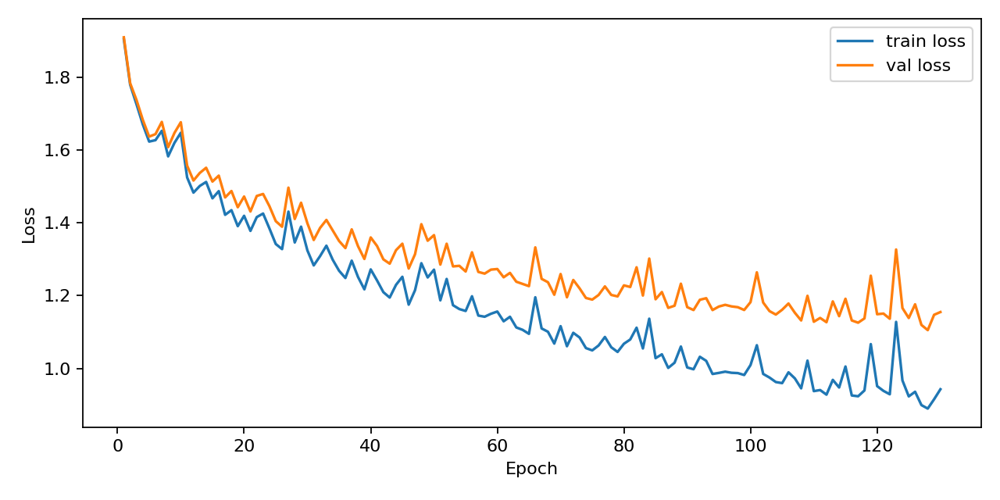
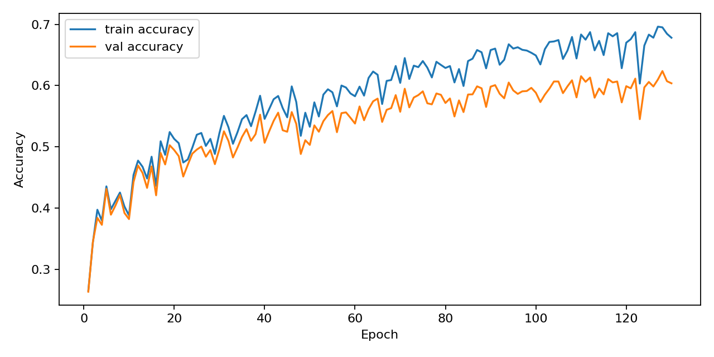
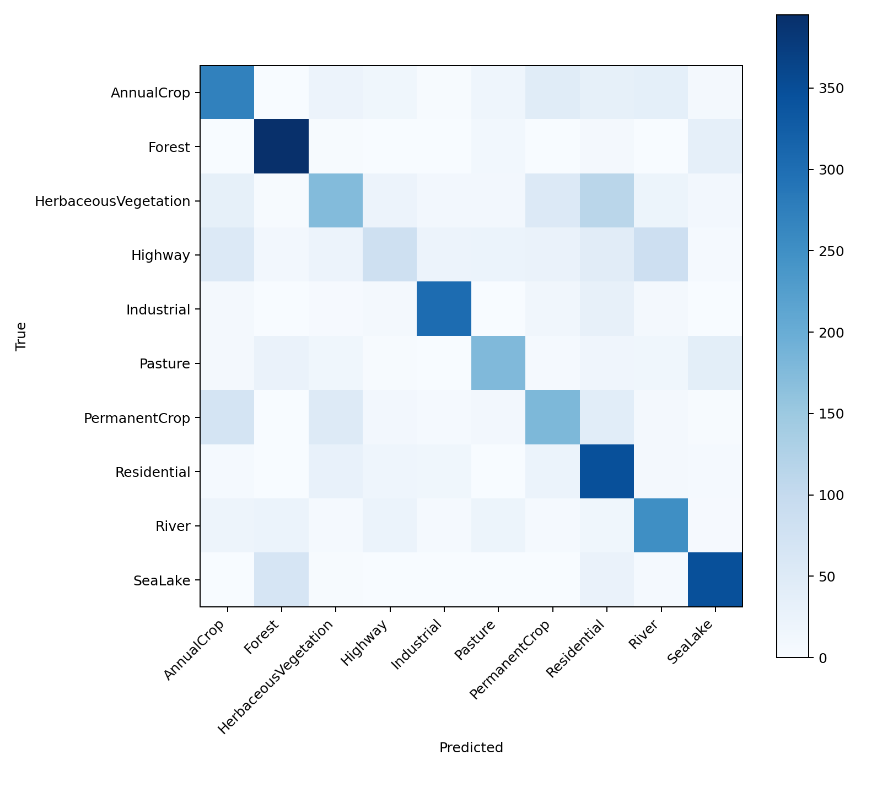
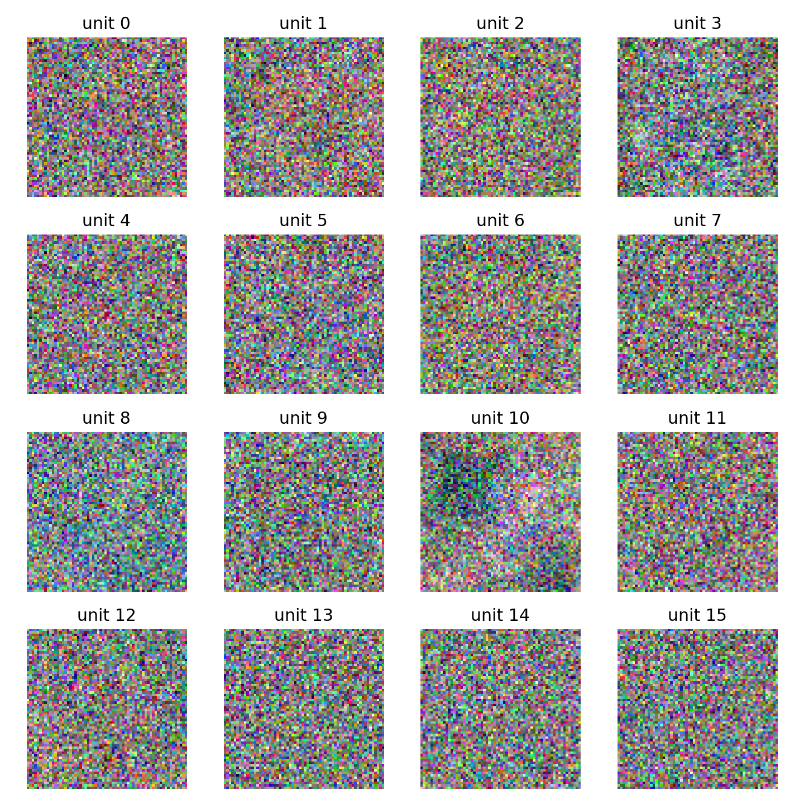
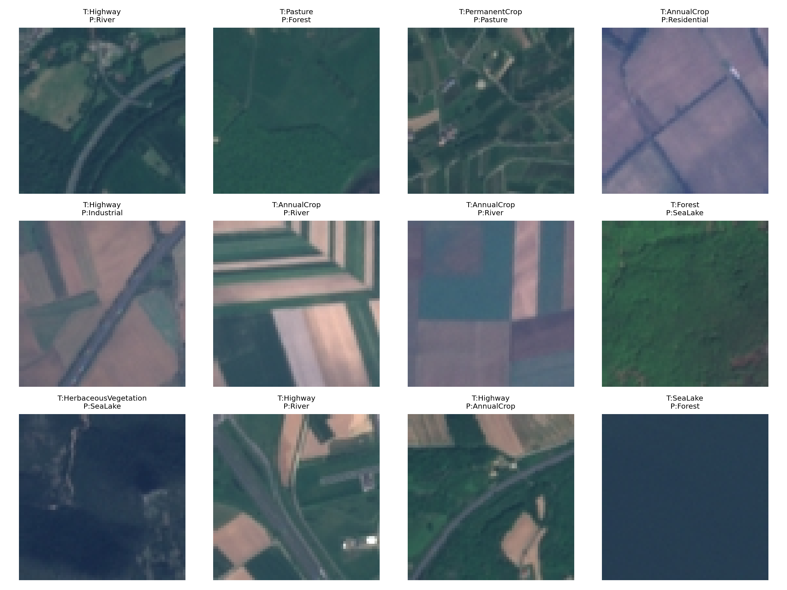

# HW1：从零构建三层神经网络分类器实现 EuroSAT 地表覆盖图像分类

GitHub Repo：[https://github.com/jjjycaptain/eurosat-mlp-classifier-submit](https://github.com/jjjycaptain/eurosat-mlp-classifier-submit)

模型权重：[best_model.npz](https://drive.google.com/file/d/1RXhOvgxwVxSIqWALHtnhtih3EAq8gh6w/view?usp=sharing)

## 摘要

本实验基于 EuroSAT_RGB 遥感图像数据集，实现了一个从零构建的三层多层感知机（Multi-Layer Perceptron, MLP）分类器，用于完成 10 类地表覆盖图像分类任务。实验严格遵守作业要求，不使用 PyTorch、TensorFlow、JAX 等自动微分深度学习框架，模型的前向传播、Softmax 交叉熵损失、L2 正则、反向传播和 SGD 参数更新均使用 NumPy 手写实现。

最终模型采用 `64 x 64 x 3` RGB 图像输入，两层隐藏层维度分别为 `512` 和 `256`，激活函数为 ReLU，训练 130 个 epoch。经过本地训练和 Slurm 集群多轮超参数搜索后，最佳模型在独立测试集上取得：

- Test Loss：`1.0800`
- Test Accuracy：`62.35%`
- Best Validation Accuracy：`62.37%`

该结果符合三层 MLP 作业要求，同时也体现了 MLP 处理图像任务的局限：由于输入图像被展平成一维向量，模型无法像 CNN 一样显式利用局部空间结构，因此部分类别之间仍存在明显混淆。

## 1. 实验目标

本实验目标是手工实现一个三层神经网络分类器，并在 EuroSAT_RGB 数据集上完成地表覆盖图像分类。具体目标包括：

1. 使用 NumPy 实现 MLP 的前向传播和反向传播。
2. 支持 ReLU、Sigmoid、Tanh 等激活函数切换。
3. 使用 Softmax Cross-Entropy 作为分类损失。
4. 使用 SGD 优化器训练模型。
5. 支持学习率衰减和 L2 Weight Decay。
6. 根据验证集准确率保存最佳模型权重。
7. 输出测试集 Accuracy 和 Confusion Matrix。
8. 可视化训练过程中的 Loss 曲线、Accuracy 曲线。
9. 可视化第一层隐藏层权重，并分析空间或颜色模式。
10. 结合错误样本和混淆矩阵进行错误分析。

## 2. 数据集与预处理

### 2.1 数据集说明

实验使用 EuroSAT_RGB 数据集。该数据集包含来自卫星遥感图像的 RGB 地表覆盖样本，共 10 个类别：

| 类别编号 | 类别名称 |
| --- | --- |
| 0 | AnnualCrop |
| 1 | Forest |
| 2 | HerbaceousVegetation |
| 3 | Highway |
| 4 | Industrial |
| 5 | Pasture |
| 6 | PermanentCrop |
| 7 | Residential |
| 8 | River |
| 9 | SeaLake |

原始数据以如下形式组织：

```text
EuroSAT_RGB/
├── AnnualCrop/
├── Forest/
├── HerbaceousVegetation/
├── Highway/
├── Industrial/
├── Pasture/
├── PermanentCrop/
├── Residential/
├── River/
└── SeaLake/
```

### 2.2 数据预处理

预处理流程如下：

1. 从 `hw1.zip` 自动解压或读取 `EuroSAT_RGB/` 目录。
2. 将每张图像读取为 RGB 格式。
3. 将图像尺寸统一为 `64 x 64`。
4. 将像素值从 `[0, 255]` 归一化到 `[0, 1]`。
5. 将图像展平成一维向量：

```text
64 x 64 x 3 = 12288
```

因此，MLP 的输入维度为 `12288`。

### 2.3 数据划分

实验采用按类别分层划分的方式，将数据集划分为：

- 训练集：70%
- 验证集：15%
- 测试集：15%

分层划分可以保证每个类别在训练、验证和测试集中都有相对稳定的样本比例，避免随机划分导致某些类别在验证集或测试集中过少。

## 3. 模型结构

### 3.1 网络结构

本实验实现的是三层 MLP 分类器，结构为：

```text
Input -> Hidden Layer 1 -> Hidden Layer 2 -> Output
```

最终最佳模型配置如下：

| 模块 | 输出维度 | 激活函数 |
| --- | --- | --- |
| Input | 12288 | - |
| Hidden Layer 1 | 512 | ReLU |
| Hidden Layer 2 | 256 | ReLU |
| Output | 10 | Softmax |

### 3.2 前向传播

设输入为 `X`，第一层、第二层和输出层参数分别为：

```text
W1, b1
W2, b2
W3, b3
```

前向传播计算如下：

```text
Z1 = XW1 + b1
A1 = ReLU(Z1)

Z2 = A1W2 + b2
A2 = ReLU(Z2)

Logits = A2W3 + b3
Probs = Softmax(Logits)
```

其中 Softmax 使用数值稳定实现，会先减去每个样本 logits 的最大值，避免指数溢出。

### 3.3 激活函数

代码中支持三种隐藏层激活函数：

- ReLU
- Sigmoid
- Tanh

最终实验选择 ReLU。原因是 ReLU 计算简单，在较深或较宽的全连接网络中更不容易出现 Sigmoid/Tanh 常见的梯度饱和问题。

### 3.4 参数初始化

模型根据激活函数选择初始化方式：

- ReLU 使用 He 初始化。
- Sigmoid/Tanh 使用 Xavier 风格初始化。

这样可以降低训练初期梯度过大或过小的风险。

## 4. 损失函数与反向传播

### 4.1 Softmax Cross-Entropy Loss

分类损失使用 Softmax Cross-Entropy：

```text
Loss = - mean(log(P[y]))
```

其中 `P[y]` 表示模型对真实类别的预测概率。

为了避免 `log(0)`，实现中会对概率进行裁剪：

```text
P[y] = clip(P[y], 1e-12, 1.0)
```

### 4.2 L2 正则化

实验加入 L2 Weight Decay，正则项为：

```text
0.5 * weight_decay * (||W1||^2 + ||W2||^2 + ||W3||^2)
```

L2 正则只作用于权重矩阵，不作用于偏置项。

### 4.3 反向传播

Softmax 与交叉熵组合后，输出层 logits 的梯度可简化为：

```text
dLogits = (Probs - OneHot(y)) / batch_size
```

然后按照链式法则依次计算：

```text
dW3, db3
dW2, db2
dW1, db1
```

所有梯度均由 NumPy 矩阵运算显式计算，没有使用自动微分框架。

## 5. 训练策略

### 5.1 优化器

实验使用 SGD 优化器。参数更新公式为：

```text
W = W - learning_rate * dW
b = b - learning_rate * db
```

### 5.2 学习率衰减

每个 epoch 的学习率按如下公式衰减：

```text
lr_epoch = initial_lr * (lr_decay ** (epoch - 1))
```

最终最佳配置为：

- Initial Learning Rate：`0.007`
- Learning Rate Decay：`0.993`
- Epochs：`130`
- Batch Size：`128`
- Weight Decay：`0.00005`

### 5.3 最佳模型保存

训练过程中每个 epoch 都会在验证集上评估模型。如果当前验证集准确率高于历史最佳值，则保存当前权重为最佳模型。

训练完成后的最佳模型权重保存为 `outputs/checkpoints/best_model.npz`。由于权重文件较大，提交仓库中不直接包含该文件，需要从 Google Drive 下载后放到对应路径：

[best_model.npz](https://drive.google.com/file/d/1RXhOvgxwVxSIqWALHtnhtih3EAq8gh6w/view?usp=sharing)

最终最佳验证集结果出现在第 128 个 epoch：

| 指标 | 数值 |
| --- | --- |
| Best Epoch | 128 |
| Validation Loss | 1.1053 |
| Validation Accuracy | 0.6237 |
| Learning Rate | 0.002868 |

## 6. 超参数搜索过程

本实验先在本地完成基础训练，然后使用 Slurm 集群进行了多轮超参数搜索。搜索过程遵循“小步扩大、根据验证结果继续收缩范围”的原则。

### 6.1 主要搜索结果

| 阶段 | Hidden Dims | Epochs | Learning Rate | LR Decay | Weight Decay | Test Accuracy |
| --- | --- | --- | --- | --- | --- | --- |
| 本地基础训练 | 256 / 128 | 20 | 0.03 | 0.95 | 0.0001 | 0.5220 |
| 本地优化训练 | 512 / 256 | 40 | 0.01 | 0.97 | 0.0001 | 0.5546 |
| Slurm 第 1 轮 | 512 / 256 | 70 | 0.008 | 0.985 | 0.0001 | 0.5879 |
| Slurm 第 2 轮 | 512 / 256 | 90 | 0.008 | 0.990 | 0.00005 | 0.6059 |
| Slurm 第 3 轮 | 512 / 256 | 110 | 0.008 | 0.992 | 0.00005 | 0.6188 |
| Slurm 第 4 轮 | 512 / 256 | 130 | 0.007 | 0.993 | 0.00005 | 0.6235 |

可以看到，继续增大 epoch 并放慢学习率衰减后，模型性能持续提升。不过第四轮相较第三轮只提升约 `0.47` 个百分点，提升幅度已经较小，因此停止继续大规模搜索。

### 6.2 最终配置

最终模型采用如下配置：

```text
image_size = 64
hidden_dim1 = 512
hidden_dim2 = 256
activation = relu
epochs = 130
batch_size = 128
learning_rate = 0.007
lr_decay = 0.993
weight_decay = 0.00005
seed = 42
```

## 7. 实验结果

### 7.1 测试集指标

最终模型在测试集上的表现为：

| 指标 | 数值 |
| --- | --- |
| Test Loss | 1.0800 |
| Test Accuracy | 0.6235 |

### 7.2 Loss 曲线



从 Loss 曲线可以看到，训练集 loss 整体持续下降，验证集 loss 也在前中期下降，但后期存在一定波动。这说明模型确实学到了有效判别特征，但由于 MLP 缺乏卷积结构，对图像空间模式的表达能力有限，后期训练也会出现一定不稳定。

### 7.3 Accuracy 曲线



Accuracy 曲线显示训练准确率和验证准确率整体上升，最终最佳验证集准确率约为 `62.37%`。训练准确率高于验证准确率，说明模型存在一定过拟合趋势，但差距并不极端，L2 正则和学习率衰减对稳定训练起到了一定作用。

### 7.4 混淆矩阵



混淆矩阵显示模型对 Forest、SeaLake、Industrial、Residential 等类别识别相对较好，而在农田、草地、道路、河流、住宅区之间仍然存在较明显混淆。

## 8. 第一层权重可视化



第一层权重可视化将第一层隐藏单元对应的输入权重 reshape 回 `64 x 64 x 3` 图像形式。可以观察到部分隐藏单元具有一定颜色偏向，例如绿色、蓝色或较亮区域，这说明模型在第一层已经学习到一些与植被、水体、建筑亮度有关的低级特征。

不过，这些权重整体仍然比较分散，缺乏 CNN 卷积核那样清晰的局部边缘或纹理模式。原因是 MLP 将整张图像展平成一维向量，第一层每个神经元直接连接全部像素，不具备局部感受野和参数共享机制。因此，即使模型能学习到颜色和全局强度模式，也很难高效学习道路、河流边界、建筑纹理等局部空间结构。

## 9. 错误分析

### 9.1 错误样本



错误样本图中可以看到，部分类别之间在颜色、纹理和空间结构上存在相似性。例如农田、永久作物和草地都可能表现为大面积绿色或规则块状纹理；道路、河流和住宅区都可能包含长条状结构；住宅区和工业区都可能包含亮色屋顶和人工建筑纹理。

### 9.2 主要混淆类别

根据最终混淆矩阵，较明显的混淆包括：

| 真实类别 | 预测类别 | 错误数量 | 可能原因 |
| --- | --- | --- | --- |
| HerbaceousVegetation | Residential | 114 | 草地或植被区域中可能混有建筑或规则纹理，展平 MLP 难以区分局部结构。 |
| Highway | River | 84 | 道路和河流都可能呈现长条状结构，MLP 缺乏显式空间建模能力。 |
| PermanentCrop | AnnualCrop | 68 | 两类作物图像颜色和块状纹理相近。 |
| SeaLake | Forest | 65 | 深色水体与阴影/深绿色森林区域可能在 RGB 强度上接近。 |
| HerbaceousVegetation | PermanentCrop | 54 | 植被与作物类别颜色相近，纹理差异需要更强空间特征。 |
| Highway | AnnualCrop | 54 | 图像中道路可能穿过农田区域，展平特征容易受背景影响。 |

这些错误说明，MLP 对全局颜色和亮度模式有一定识别能力，但对局部形状、边界和空间排列的表达不足。

## 10. 讨论

### 10.1 为什么 MLP 能达到一定准确率

EuroSAT_RGB 中不同类别具有一定颜色和纹理差异。例如森林通常绿色更密集，水体通常偏蓝或暗色，工业区和住宅区往往有较多亮色人工建筑区域。因此，即使不使用卷积结构，MLP 仍然可以通过大量全连接参数学习到部分全局颜色和纹理统计特征。

### 10.2 为什么 MLP 性能有限

MLP 的主要限制在于：

1. 图像被展平成一维向量后，原本相邻像素的空间关系不再显式存在。
2. 全连接层参数量大，训练样本有限时容易过拟合。
3. 没有卷积层的局部感受野，难以稳定学习道路、河流、建筑边界等局部结构。
4. 没有参数共享机制，同一种局部纹理出现在不同位置时需要分别学习。

因此，虽然最终测试准确率达到 `62.35%`，但相较 CNN 等更适合图像任务的模型仍有明显提升空间。

### 10.3 超参数搜索观察

实验中发现，较大的隐藏层维度和更长训练时间可以显著提升 MLP 性能。本地初始模型测试准确率约为 `52.20%`，经过 Slurm 多轮搜索后提升到 `62.35%`。其中较有效的调整包括：

- 将隐藏层扩大到 `512 / 256`。
- 将训练轮数增加到 `130`。
- 将初始学习率降低到 `0.007`。
- 使用更慢的学习率衰减 `0.993`。
- 将 weight decay 调整为 `0.00005`。

不过，第四轮相较第三轮只提升约 `0.47` 个百分点，说明当前 MLP 结构已经接近该设置下的收益平台期。

## 11. 结论

本实验完成了一个从零实现的三层 MLP 图像分类器，并在 EuroSAT_RGB 数据集上完成了 10 类地表覆盖分类。实验实现了数据加载、归一化、分层划分、前向传播、Softmax 交叉熵、反向传播、SGD、学习率衰减、L2 正则、最佳模型保存、测试评估、混淆矩阵、训练曲线、第一层权重可视化和错误样本分析。

最终模型在测试集上取得：

```text
Test Accuracy = 62.35%
Test Loss = 1.0800
```

该结果说明，纯 NumPy 实现的三层 MLP 能够在 EuroSAT_RGB 上学习到一定的地表覆盖判别特征，尤其是颜色和全局纹理统计特征。但由于 MLP 不具备卷积结构，无法有效建模图像局部空间模式，因此仍存在道路/河流、作物/植被、住宅/植被等类别混淆。整体来看，本实验满足作业关于从零实现神经网络分类器、训练评估、可视化和错误分析的要求，也展示了 MLP 在图像分类任务中的能力与局限。
